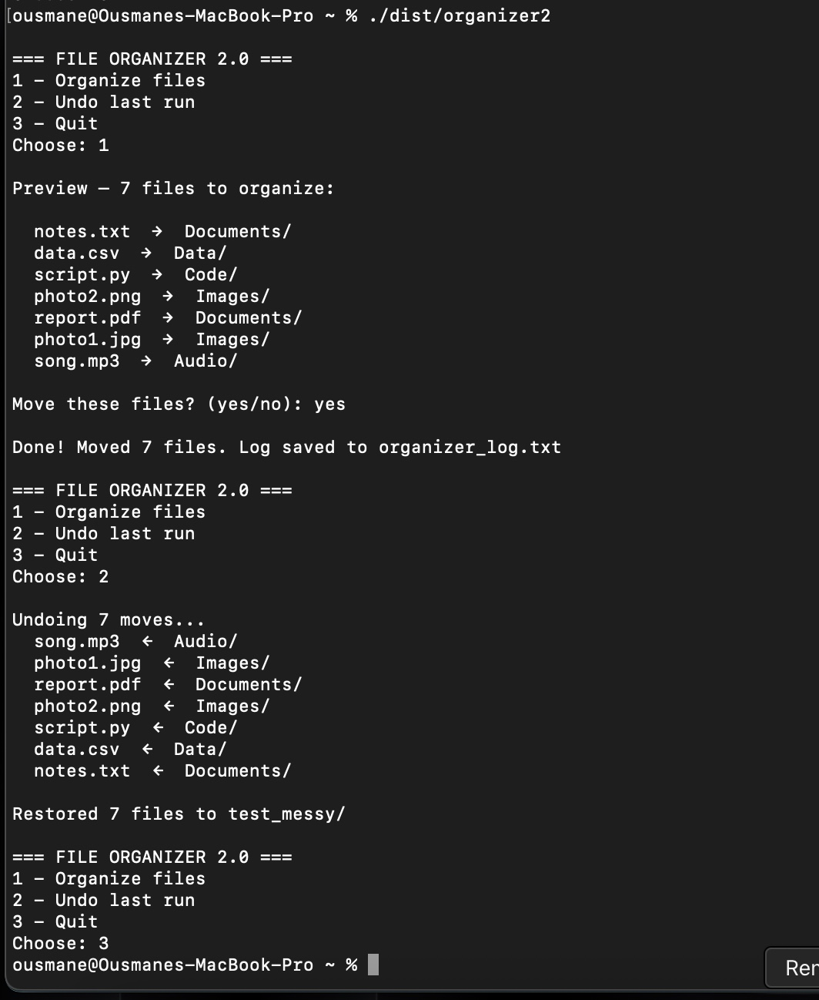

# File Organizer 2.0

A safe file automation tool that sorts messy folders by file type — with preview, confirmation, full logging, and undo.

## The problem it solves

Manually sorting hundreds of files takes hours. This tool does it in seconds — safely.

## Features

- **Dry-run preview** — see exactly what will be moved before anything happens
- **Confirmation required** — nothing moves without approval
- **Timestamped log** — a full audit trail of every action
- **Undo** — reverse the last run instantly
- **Standalone app** — packaged with PyInstaller, runs without Python installed

## Demo



## How it works

Files are matched to categories by extension and moved into subfolders:

| Category | Extensions |
|---|---|
| Images | .jpg, .jpeg, .png, .gif |
| Documents | .pdf, .txt, .docx |
| Data | .csv, .xlsx, .json |
| Code | .py, .html, .sql |
| Audio | .mp3, .wav |

## Built with

Python · `os` · `shutil` · `datetime` · PyInstaller

## Usage

```
python3 organizer2.py
```

Then choose: `1` to organize, `2` to undo, `3` to quit.
