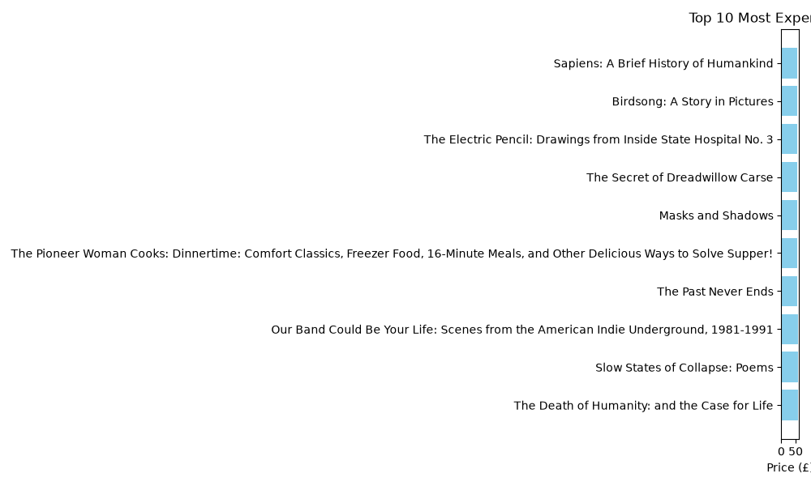

# Book Scraper

A multi-page web scraper that collects book data, analyses prices with Pandas, and generates visual reports.

## The problem it solves

Collecting product data across dozens of pages by hand takes hours and is error-prone. This tool scrapes it all in seconds and delivers a clean, analysis-ready spreadsheet.

## Features

- **Multi-page scraping** — automatically walks through paginated listings
- **Clean data export** — outputs a CSV ready to open in Excel or Google Sheets
- **Price analysis** — average, minimum, and maximum prices via Pandas
- **Visual report** — bar chart of the top 10 most expensive items
- **Menu interface** — run analysis or regenerate the chart on demand

## Demo



## Sample output

The scraper produces a two-column CSV:

| Title | Price |
|---|---|
| A Light in the Attic | 51.77 |
| Tipping the Velvet | 53.74 |

See `books_report.csv` for the full dataset.

## Built with

Python · `requests` · `BeautifulSoup` · `pandas` · `matplotlib` · `csv`

## Usage

```
python3 project.py
```

The scraper runs automatically, then offers a menu: `1` for statistics, `2` to generate the chart, `3` to quit.
